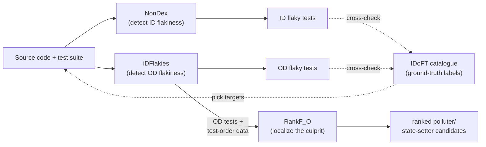

# Combined Findings — NonDex, iDFlakies & RankF

A single report tying together the three tool runs: **what** each does, **why** it matters, **how** it
was run, and the **results** — all on real, IDoFT-catalogued subjects, reproduced from scratch.

Per-tool detail lives in each `results/<tool>/<project>/findings.md`; this document is the overview.

---

## 1. What & why — the problem

A **flaky test** passes and fails on the *same* code with no changes. It erodes trust in a test suite:
developers stop believing red builds, and real regressions slip through. Flaky tests come in distinct
*families*, each with a different root cause — and therefore a different detection tool. This work
covers three points along that pipeline:



| Family | Root cause | Detector here |
|--------|-----------|---------------|
| **ID** — Implementation-Dependent | Code assumes an order Java never guarantees (`HashMap`/`HashSet` iteration, reflection field order) | **NonDex** |
| **OD** — Order-Dependent | A test's outcome depends on *which other tests ran before it* (shared static state) | **iDFlakies** |
| *(localization, not a family)* | Given an OD test, *which other test* is the culprit? | **RankF** (`RankF_O`) |

**IDoFT** (International Dataset of Flaky Tests) is **not** a tool — it's a catalogue (a CSV of known
flaky tests + labels). It was used only to (a) pick subjects known to contain flakiness and (b)
cross-check each tool's output against ground truth.

---

## 2. How — one reproducible method for all runs

Every run followed the same recipe, so results are reproducible by anyone with Docker:

1. **Pick a target** from IDoFT: a `(project, commit SHA, module, category)` row.
2. **Rebuild the exact environment** in Docker (JDK 11 + Maven; no local Java needed).
3. **Clone the project at that SHA**, run the tool, **capture raw output** into `results/`.
4. **Cross-check** the tool's findings against IDoFT's labels.

`RankF_O` adds a 4th, code-free step: pure-Python ranking over the test-order data iDFlakies produced.

```
docker compose --profile gson         up   # NonDex   → google/gson
docker compose --profile fastjson2    up   # NonDex   → alibaba/fastjson2
docker compose --profile http-request up   # iDFlakies→ kevinsawicki/http-request
python rankf/run_on_http_request.py         # RankF_O  → over the iDFlakies data above
```

---

## 3. Results per tool

### 3.1 NonDex — implementation-dependent (ID) flaky tests

**How it works:** re-runs tests while *legally* shuffling under-determined Java APIs. A test that
passes normally but fails when shuffled was relying on an order that was never guaranteed.

| Project | SHA | Module | Tests targeted | ID tests found | vs IDoFT |
|---------|-----|--------|----------------|----------------|----------|
| `google/gson` | `e685705b` | `gson` | MapTest, FieldNamingTest, CollectionTest | **12** | 12/12 ✅ |
| `alibaba/fastjson2` | `450d9fe5` | `core` | MapSortFieldTest, ObjectWriterSetTest, Issue507/586/1494 | **6** | 6/6 ✅ |

**Concrete example** (`gson` `CollectionTest.testPriorityQueue`): a `PriorityQueue` of `[10,20,22]` is
serialized and asserted to equal `[10,20,22]` — but that iteration order is never guaranteed, so under
shuffling it emerges as `[22,10,20]` and the assertion breaks.

→ [gson findings](results/nondex/gson/findings.md) · [fastjson2 findings](results/nondex/fastjson2/findings.md)

### 3.2 iDFlakies — order-dependent (OD) flaky tests

**How it works:** re-runs the *whole* suite in many random test-orders; flags any test whose pass/fail
outcome flips, then re-verifies each by replaying its exact passing and failing orders.

| Project | SHA | Module | Suite size | Rounds | OD tests found | vs IDoFT |
|---------|-----|--------|-----------|--------|----------------|----------|
| `kevinsawicki/http-request` | `2d62a3e9` | `lib` | 163 tests | 10 | **28** | 28/28 ✅ |

Detection converged (rounds 8–10 found 0 new tests), confirming 10 rounds was sufficient:

```
Round 1: 12 new   Round 4: 1   Round 7: 1
Round 2: 11 new   Round 5: 1   Round 8-10: 0  (converged)
Round 3:  1 new   Round 6: 1
```

→ [http-request findings](results/idflakies/http-request/findings.md)

### 3.3 RankF_O — localizing the culprit

**How it works:** given an OD test and its test-order history, score every other test by likelihood of
being the polluter/state-setter — using only pass/fail patterns, no code analysis. (`RankF_L`, the
LLM variant, needs a GPU and was not run; `RankF_O` was reimplemented from the paper's formulas.)

| Input | OD tests ranked | Heuristics × strategies | Total ranking time | Top suspect |
|-------|-----------------|--------------------------|--------------------|-------------|
| iDFlakies test-order data (§3.2) | 28 | 5 × 3 | **269 ms** | `customConnectionFactory` (#1 for **11 / 28** tests) |

**Validation against source:** the #1 suspect calls
`HttpRequest.setConnectionFactory(...)`, which mutates a **static field** shared by every other test —
a textbook *polluter*, confirming RankF_O's purely statistical guess against the actual code.

→ [http-request findings](results/rankf/http-request/findings.md) · [how it works](rankf/README.md)

---

## 4. Consolidated results

| Tool | Subject | What it found | Matched IDoFT | Headline |
|------|---------|---------------|---------------|----------|
| NonDex | gson + fastjson2 | **18** ID flaky tests | 18/18 (100%) | Reproduced known unordered-API assumptions |
| iDFlakies | http-request | **28** OD flaky tests | 28/28 (100%) | Perfect reproduction of the catalogued OD set |
| RankF_O | http-request | Ranked culprits for all 28 | — (no local ground truth) | 269 ms; #1 suspect verified against source |

**Cross-cutting observations:**
- **Detection is a solved, reliable step** — both detectors reproduced IDoFT's labels exactly (46/46).
- **The two families are genuinely different bugs.** NonDex's `gson`/`fastjson2` failures are about
  *unordered data inside one run*; iDFlakies' `http-request` failures are about *test execution order*.
  No overlap — which is exactly why two tools exist.
- **Localization is the interesting open part.** RankF_O found a strong, verifiable signal almost
  instantly using nothing but pass/fail patterns — the most promising thread for future work.

---

## 5. Honest limitations

- **No verified localization ground truth.** `idflakies:minimize` (which computes the true polluter)
  only exists in unreleased source — Maven Central only ever published `2.0.0`, without those goals.
  So RankF_O's ranking is validated by manual source inspection, not against a precise accuracy metric.
- **`RankF_L` not run** (needs a GPU); only `RankF_O` was reproduced.
- **NonDex runs targeted a subset of each suite** (specific known-ID classes) for speed; iDFlakies ran
  the full suite.

---

## 6. Environment gotchas worth recording

| Gotcha | Fix |
|--------|-----|
| NonDex 2.2.1 dies on JDK 8 (`Unrecognized option: --add-exports`) | Use JDK 9+ (image is JDK 11) |
| `http-request` `pom.xml` hardcodes Java 1.5; modern JDKs reject it | Runner auto-patches `1.5` → `1.8` (compiler-acceptance only) |
| `idflakies:minimize` goal missing | Only `2.0.0` is on Maven Central; `minimize`/`fix` need building from source |
| RankF official artifact page unreachable | Google Sites bot-block → reimplemented `RankF_O` from the paper |
